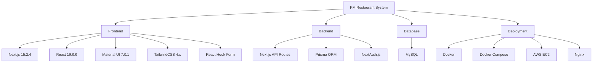
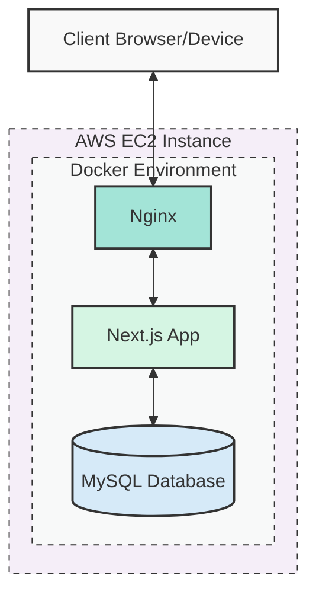
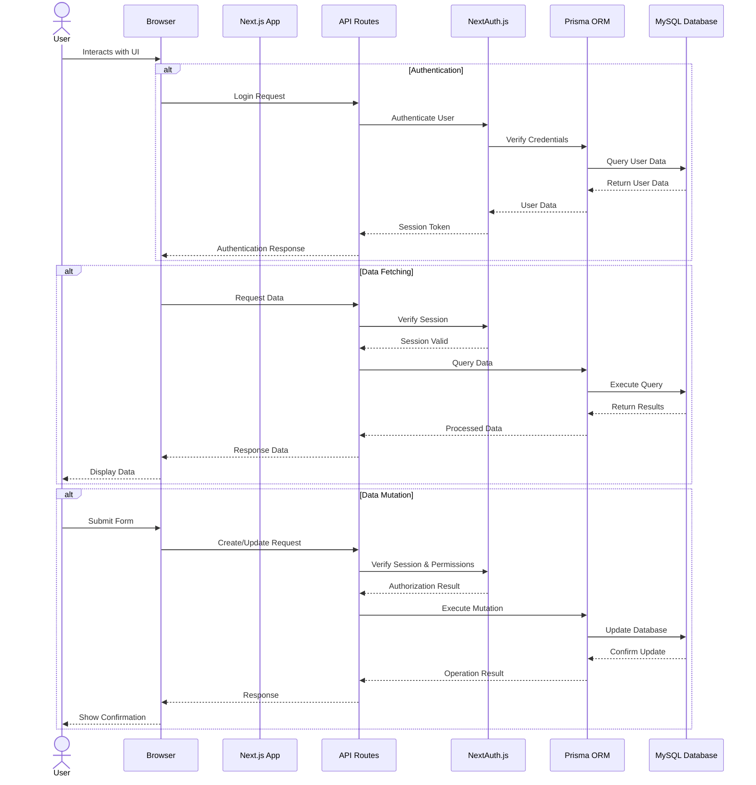

# Technical Stack

This document provides an overview of the technologies used in the PM Restaurant project.

## Technology Overview



## Frontend

| Technology         | Version | Description                                          |
| ------------------ | ------- | ---------------------------------------------------- |
| Next.js            | 15.2.4  | React framework with App Router                      |
| React              | 19.0.0  | UI library                                           |
| Material UI        | 7.0.1   | React component library implementing Material Design |
| TailwindCSS        | 4.x     | Utility-first CSS framework                          |
| React Hook Form    | 7.55.0  | Form validation and handling                         |
| TypeScript         | 5.x     | Static typing for JavaScript                         |
| Day.js             | 1.11.10 | Date manipulation library                            |
| Notistack          | 3.0.2   | Notification system                                  |
| Lucide React       | 0.487.0 | Icon library                                         |
| MUI X Date Pickers | 6.19.7  | Date and time picker components                      |

## Backend

| Technology         | Version | Description              |
| ------------------ | ------- | ------------------------ |
| Next.js API Routes | 15.2.4  | RESTful API endpoints    |
| Prisma             | 6.5.0   | ORM for database access  |
| NextAuth.js        | 4.24.11 | Authentication system    |
| bcryptjs           | 3.0.2   | Password hashing         |
| JSON Web Token     | 9.0.2   | JWT implementation       |
| MySQL2             | 3.14.0  | MySQL client for Node.js |

## Database

| Technology        | Version | Description                        |
| ----------------- | ------- | ---------------------------------- |
| MySQL             | 8.x     | Relational database                |
| Prisma Schema     | 6.5.0   | Database schema definition         |
| Prisma Migrations | 6.5.0   | Database versioning and migrations |

## Development Tools

| Technology | Version | Description                      |
| ---------- | ------- | -------------------------------- |
| ESLint     | 9.x     | JavaScript/TypeScript linter     |
| TypeScript | 5.x     | JavaScript type checking         |
| ts-node    | 10.9.2  | TypeScript execution environment |
| npm        | 11.2.0  | Package manager                  |

## Deployment Infrastructure

| Technology     | Version | Description                   |
| -------------- | ------- | ----------------------------- |
| Docker         | Latest  | Container platform            |
| Docker Compose | Latest  | Multi-container orchestration |
| AWS EC2        | N/A     | Cloud hosting                 |
| Nginx          | Latest  | Web server and reverse proxy  |

## System Architecture



## Data Flow



## Key Dependencies in package.json

```json
{
  "dependencies": {
    "@auth/prisma-adapter": "^2.8.0",
    "@emotion/cache": "^11.14.0",
    "@emotion/react": "^11.14.0",
    "@emotion/styled": "^11.14.0",
    "@hookform/resolvers": "^5.0.1",
    "@mui/icons-material": "^7.0.1",
    "@mui/material": "^7.0.1",
    "@mui/material-nextjs": "^7.0.0",
    "@mui/x-date-pickers": "^6.19.7",
    "@prisma/client": "^6.5.0",
    "@radix-ui/react-slot": "^1.1.2",
    "class-variance-authority": "^0.7.1",
    "clsx": "^2.1.1",
    "dayjs": "^1.11.10",
    "jsonwebtoken": "^9.0.2",
    "lucide-react": "^0.487.0",
    "mysql2": "^3.14.0",
    "next": "15.2.4",
    "next-auth": "^4.24.11",
    "notistack": "^3.0.2",
    "prisma": "^6.5.0",
    "react": "^19.0.0",
    "react-dom": "^19.0.0",
    "react-hook-form": "^7.55.0",
    "tailwind-merge": "^3.1.0"
  },
  "devDependencies": {
    "@eslint/eslintrc": "^3",
    "@tailwindcss/postcss": "^4",
    "@types/bcryptjs": "^3.0.0",
    "bcryptjs": "^3.0.2",
    "eslint": "^9",
    "eslint-config-next": "15.2.4",
    "tailwindcss": "^4",
    "ts-node": "^10.9.2",
    "typescript": "^5"
  }
}
```

## Notes on Technology Choices

- **Next.js**: Used for both frontend and backend functionality, enabling server-side rendering and API routes in a single codebase.
- **Material UI**: Provides a comprehensive set of pre-styled components that follow Material Design guidelines.
- **Prisma**: Modern ORM that simplifies database operations with type safety and migrations.
- **Docker**: Ensures consistent environments across development and production.
- **NextAuth.js**: Provides authentication with multiple providers and session management.
- **TypeScript**: Adds static typing to improve code quality and developer experience.
- **TailwindCSS**: Complements Material UI by providing utility classes for custom styling.
